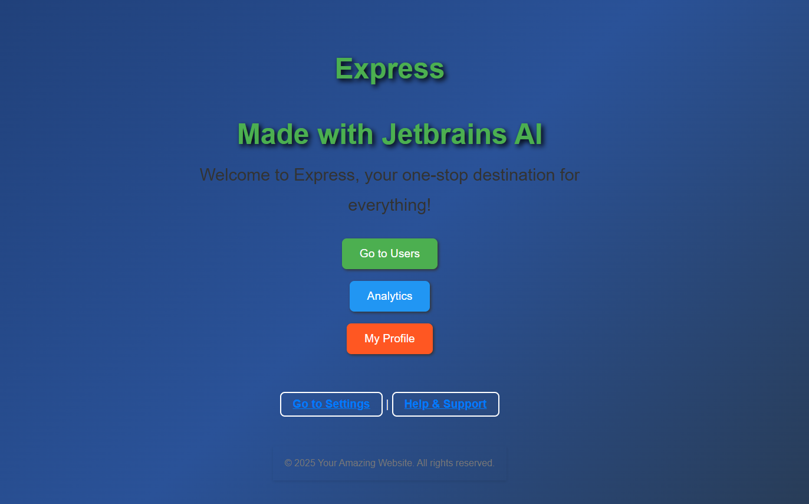

# <span style="display: inline-block; animation: fadeInOut 2s infinite;">🌟 Node.js Express Starter Project with Intellij 🌟</span>


  


## Features

- 🚀 **Express.js**: A fast, minimal, and powerful web application framework for Node.js.
- 📜 **Morgan**: Elegant HTTP request logger middleware for streamlined debugging.
- 🍪 **Cookie-parser**: Effortlessly parses cookies from client requests for easy access.
- 🛠️ **Debug**: A powerful utility for debugging and tracking your application with ease.
- ⚠️ **HTTP-errors**: Simplifies creating and managing HTTP error responses.
- ✨ **Pug**: A modern templating engine for building dynamic and beautiful HTML views.

## Prerequisites

Before you dive in, make sure you’ve got these essentials ready to roll:

- 🚀 [Node.js](https://nodejs.org/) (LTS version recommended) – The backbone of this application.
- 🐳 [Docker](https://www.docker.com/get-started) – For containerizing and streamlining your setup.
- 📦 [Docker Compose](https://docs.docker.com/compose/) – Orchestrate multiple containers with ease.

## 🚀 Local Setup

1. **Clone the Repository**:

   ```bash
   git clone https://github.com/RomanR-dev/express_js_learning_1.git
   cd express_js_learning_1
   ```

2. **Install Dependencies**:

   ```bash
   npm install
   ```

3. **Start the Application Locally**:

   ```bash
   cd frontend
   npm start
   ```

   🌟 Your app will be live at: [http://localhost:3000](http://localhost:3000) 🎉

## Using Docker Compose to Run the Application

You can use Docker Compose to run the application in a containerized environment.

### Steps

1. Build and start the application using `docker-compose`:

   ```bash
   docker compose build
   docker compose up
   ```

2. Once the containers are running, the application will be available at:

   ```bash
   http://localhost:3000
   ```

   🌟 The app is live and ready for action! 🎉

3. To stop the application, gracefully shut it down by running:

   ```bash
   docker-compose down
   ```

### Example `docker-compose.yml`

Below is an example of a `docker-compose.yml` configuration file you can use for this project:

```yaml
version: '3.8'

services:
  app:
    build:
      context: .
    image: express-app:latest
    ports:
      - "3000:3000"
```  

## Project Structure

- **`app.js`**: Main application file where middleware and routes are defined.
- **`routes/`**: Contains route files for handling specific endpoints.
- **`views/`**: Contains Pug templates for rendering HTML views.
- **`public/`**: Static files such as CSS, JavaScript, and images.
- **`bin/`**: Contains executable files like `www` to start the server.

## Website example:

🌐 **Preview of the Website in Action**:



✨ Experience the sleek design and functionality of the Node.js Express Starter Project! 🚀
